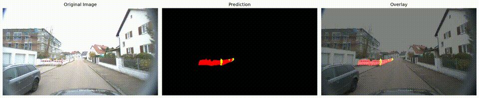

# Roadwork Zone Semantic Segmentation (DeepLabV3+)

Semantic segmentation for roadwork-zone elements (Barrier and Road Beacon) using a custom DeepLabV3+ pipeline with a MobileNetV2 backbone.

> Attribution: Adapted from [DeepLabV3Plus-Pytorch](https://github.com/VainF/DeepLabV3Plus-Pytorch) by VainF.

## Highlights

- 3-class segmentation (Background, Barrier, Road Beacon)
- TensorBoard logging for loss, accuracy, and mIoU
- Visualization pipeline for masks and overlays

## Result




## Requirements

Install dependencies:

```bash
pip install -r requirements.txt
```

## Dataset Structure

Expected layout (default):

```
RZDG_real_seg/
    img_dir/
        train/
        val/
    ann_dir/
        train/
        val/
```

Set the dataset root with the environment variable below, or edit the config class in train.py.

## Configuration

Key configuration options are inside `Config` in train.py and `PredictConfig` in predict.py.

Environment variables (optional):

- DATA_ROOT: dataset root directory (default: ./RZDG_real_seg)
- PRETRAINED_MODEL_PATH: path to a pretrained backbone or model (default: ./checkpoints/best_deeplabv3plus_mobilenet_voc_os16.pth)

## Training

Start training:

```bash
python train.py
```

Artifacts:

- Checkpoints: ./checkpoints
- Logs: ./runs (use TensorBoard)

TensorBoard:

```bash
tensorboard --logdir=./runs
```

## Evaluation

Compute mIoU on the validation set:

```bash
python extra/evaluate_miou.py
```

## Inference

Run prediction on a folder of images:

```bash
python predict.py
```

Outputs:

- Masks and overlays in ./results

## Reproducibility Notes

- Set `seed` values in train.py for deterministic behavior.
- Confirm the same dataset split when comparing experiments.

## Acknowledgements

DeepLabV3Plus-Pytorch by VainF: https://github.com/VainF/DeepLabV3Plus-Pytorch
